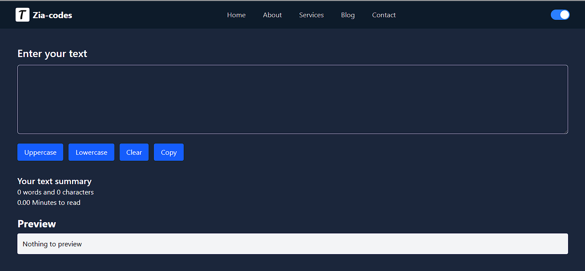
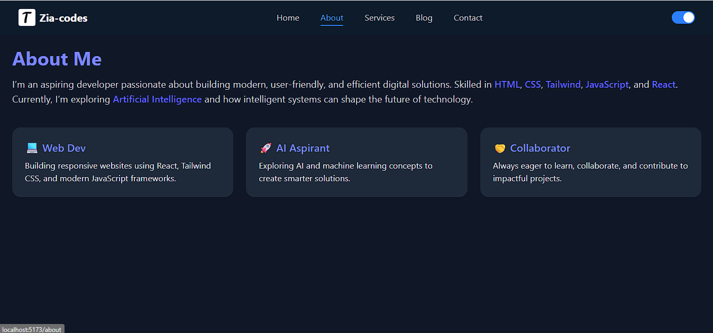

# 🌟 Zia Codes — React Web App

<p align="center">
  <!-- Badges -->
  
  
  
</p>

<!-- Typing animation -->
<p align="center">
  
</p>

---

## 🚀 Live Demo
[👉 View Live on GitHub Pages](https://zia-codes.github.io/react-web)

---

## Screenshots

### Home Page


### About Page



---

## ✨ Features
- 🌗 **Dark/Light Mode Toggle**  
- ⚡ **Real-time Alerts**  
- 📝 **Interactive Forms**  
- 🔀 **Client-side Routing** with React Router  
- 🎨 **Framer Motion Animations** + Tailwind CSS UI  

---

## 🛠 Tech Stack
- React (Vite)  
- Tailwind CSS  
- React Router  
- Framer Motion  

---

## 💻 Run Locally

```bash
git clone https://github.com/zia-codes/react-web.git
cd react-web
npm install
npm run dev
